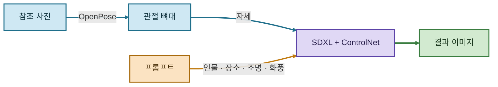
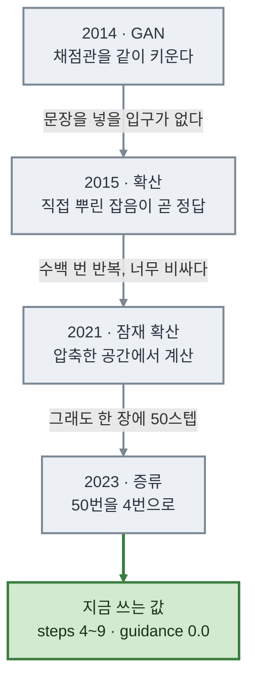

사진 한 장에서 **자세만** 가져와, 전혀 다른 인물과 장소를 같은 포즈로 그리는 도구를 만들었습니다.


*▲ 왼쪽 사진에서 자세만 뽑았습니다. 프롬프트에는 자세를 한 글자도 쓰지 않았습니다.*

> **한 줄 요약**
> 프롬프트로 정할 수 있는 것과 없는 것이 갈립니다. **자세는 없는 쪽**입니다.
> 그 칸만 떼어 뼈대 그림에 맡기면, 나머지는 프롬프트가 자유롭게 바꿀 수 있습니다.

> 📦 저장소: [rome777/pose-image-tool](https://github.com/rome777/pose-image-tool) · ▶️ [Colab에서 바로 열기](https://colab.research.google.com/github/rome777/pose-image-tool/blob/main/pose_tool.ipynb)

---

## 1. 모델이 지시를 무시했습니다

참조로 쓸 사진을 만들며 이렇게 적었습니다.

```
... left arm raised straight up above the head,
    right arm extended horizontally to the side ...
```

**왼팔은 머리 위로, 오른팔은 옆으로.** 나온 것은 두 팔을 얌전히 내린 차렷 자세였습니다. 요청한 팔 동작이 통째로 사라졌습니다.

프롬프트를 더 세게 써 볼 수도 있었지만, 이게 바로 이 도구가 필요한 이유였습니다. **자세는 글로 지시해도 잘 안 듣습니다.** 그래서 나온 그대로 뼈대를 뽑아 실습에 썼습니다.

---

## 2. 그림 한 장에는 채워야 할 칸이 여섯 개 있습니다

사진작가는 셔터를 누르기 전에 이 여섯을 어떤 식으로든 정합니다. 생성 모델도 같습니다. 다만 **안 정해 주면 모델이 정합니다.** 내 의도와 무관하게, 학습 데이터에서 가장 흔했던 값으로요.

| 칸 | 무엇을 정하는가 | 안 적으면 |
| --- | --- | --- |
| 피사체 | 누가 있는가, 몇 명인가 | 생각보다 여러 명이 나옵니다 |
| 동작 | 무엇을 하는가, 어디를 보는가 | **카메라를 정면으로 봅니다** |
| 카메라 | 샷 크기 · 각도 · 렌즈 | 어정쩡한 구도가 붙습니다 |
| 조명 | 빛이 어디서 오는가 | 밋밋한 정면광이 붙습니다 |
| 환경 | 어디이고 언제인가 | 배경이 잡동사니로 찹니다 |
| 스타일 | 사진인가 그림인가 | 제각각으로 흔들립니다 |

그래서 **좋은 프롬프트는 긴 것이 아니라 빈 칸이 없는 것**입니다. 결과가 시원찮을 때 모델부터 바꾸는 건 대개 가장 나중에 할 일입니다.

곁들여 알게 된 것들:

- `masterpiece`, `8k` 같은 옛날 주문은 요즘 모델에서 **대개 아무 일도 하지 않습니다.** 그 자리에 "다큐멘터리 사진, 얕은 심도"를 적는 편이 낫습니다.
- 쉼표로 이은 키워드보다 **문장**이 낫습니다. 요즘 모델은 프롬프트를 언어모델이 읽습니다.
- **부정형보다 긍정형.** "사람이 없는 공장"에는 사람이 나오기도 합니다. "텅 빈 공장"이 잘 통합니다.
- 길이는 **60~120단어**. 길어질수록 서로 모순되는 지시가 섞일 위험만 커집니다.

---

## 3. 자세는 뼈대가, 나머지는 프롬프트가

ControlNet은 참조 그림에서 **사람 관절 위치만** 뽑아 조건으로 넣어 주는 보조 회로입니다. 원본 사진은 보지 않고 **뼈대 그림만** 봅니다. 그래서 인물·옷·배경은 프롬프트가 마음대로 바꿀 수 있습니다.



*▲ 파란 길은 **자세**를, 주황 길은 **나머지 다섯 칸**을 나릅니다.*

여기서 규칙 하나가 따라옵니다. **프롬프트에서 동작 칸은 비워 둡니다.** 그 칸은 이미 뼈대가 채웠습니다. 자세를 글로 또 적으면 뼈대와 부딪혀 둘 다 아닌 그림이 나옵니다.

구성은 이렇게 잡았습니다.

| 구성 | 쓴 것 |
| --- | --- |
| 본체 모델 | `stabilityai/stable-diffusion-xl-base-1.0` |
| 포즈 ControlNet | `thibaud/controlnet-openpose-sdxl-1.0` |
| fp16 VAE | `madebyollin/sdxl-vae-fp16-fix` |
| 포즈 추출 | `controlnet_aux` + `lllyasviel/Annotators` |

수업에서 쓴 FLUX.2-klein 4B로 하고 싶었지만 **공식 ControlNet이 없었습니다.** 포즈 조건이 가장 잘 갖춰져 있고 무료 T4에서 도는 SDXL 계열로 갔습니다.

---

## 4. 무엇을 고정하고 무엇을 바꿨나

한 번에 하나씩만 바꿨습니다. 그래야 무엇 때문에 달라졌는지 말할 수 있습니다.

### 실험 1 · 뼈대는 그대로, 프롬프트만


공장 노동자 / 우주 비행사 / 한복 차림 선비. **자세는 세 장 모두 유지**되고 인물·옷·배경·화풍만 바뀌었습니다. 세 번째는 지시한 대로 화풍까지 수채화로 넘어갔습니다.

### 실험 2 · 프롬프트는 그대로, 뼈대만


프롬프트를 **한 글자도 안 바꾸고** 시드도 같게 둔 채 뼈대만 갈아 끼웠습니다. 안전모와 작업복, 공장 배경은 그대로인 채 **자세만 무릎 꿇은 자세로** 바뀌었습니다.

두 실험을 나란히 놓으면 역할이 선명해집니다. 프롬프트는 **"무엇이 있는가"**, 뼈대는 **"어떤 자세인가"** 입니다.

### 실험 3 · 자세를 얼마나 세게 강제할까


`controlnet_conditioning_scale` 한 값만 바꿨습니다.

| scale | 나온 것 |
| --- | --- |
| 0.3 | **인물이 뒤로 돌아섰습니다.** 서 있다는 것만 맞습니다 |
| 0.8 | 뼈대를 따르면서 화풍·조명 지시도 살아 있습니다 |
| 1.2 | 자세는 정확한데 **손이 무너지고** 주인 없는 기계 부품이 붙었습니다 |

그래서 **"자세가 안 따라온다"는 프롬프트가 아니라 이 값을 볼 문제**입니다. 다만 올릴수록 손이 나빠져서 0.8 부근이 절충점이었습니다.

---

## 5. 같은 조건이면 같은 그림이 나오는가

같은 시드·프롬프트·뼈대로 한 번 더 뽑아 파일 해시를 비교했습니다.

```
output_01.png    ef353293140b255f
repro_check.png  ef353293140b255f   ← 같은 조건으로 다시 뽑음
output_02.png    f5bdc989f4e197c4   ← 뼈대만 다름
```

**픽셀 차이 0.** 이게 되려면 두 가지가 필요합니다.

**하나, 이미지마다 기록을 같이 남깁니다.** 프롬프트만 적어 두고 시드를 빼먹으면 내일 같은 그림을 못 뽑습니다. 그래서 `out/{이름}.json` 에 프롬프트·시드·모델·스텝·가이던스를 함께 저장합니다.

**둘, 시드를 만들 때 파이썬 기본 `hash()` 를 쓰지 않습니다.** 보안상의 이유로 실행할 때마다 값이 달라지도록 되어 있습니다.

```python
seed = hash(name) % (2**32)                                    # 실행마다 달라진다
seed = int(hashlib.sha256(name.encode()).hexdigest()[:8], 16)  # 언제나 같다
```

---

## 6. 코드에 박힌 숫자에는 내력이 있습니다

`steps=25`, `guidance_scale=5.0` 이 왜 그 값인지는 이 계보에서 나옵니다.



각 단계가 앞 단계의 막힌 곳을 풀었고, 그 결과가 지금 코드의 숫자로 남았습니다. 실무에 쓰이는 결론은 하나입니다.

> **증류판인가 아닌가가 `guidance_scale` 을 정합니다.**
> 이름에 `turbo`, `schnell`, `fast` 가 붙으면 대개 증류판이고, 이때는 **`0.0`** 입니다.
> 프롬프트를 얼마나 세게 밀지가 이미 모델 안에 구워져 있어서, 밖에서 또 밀면 그림이 상합니다.
> 증류되지 않은 기본판이면 **3~7**. 이번에 쓴 SDXL이 여기라 5.0을 줬습니다.

모델 이름만 갈아 끼우고 이 값을 그대로 두면 결과가 이상해집니다.

---

## 7. 막혔던 곳

로컬에 GPU가 없어 전부 무료 Colab에서 돌렸습니다. 붙은 것은 `Tesla T4 / VRAM 14.6GB` 였습니다.

**① 한 장에 몇 분씩 걸렸습니다.** 가장 오래 헤맸습니다. VRAM을 아끼려고 두 파이프라인에 오프로드를 걸었는데, 그 둘이 **같은 모듈을 공유**하고 있었습니다.

```python
pose2i = StableDiffusionXLControlNetPipeline(**t2i.components, controlnet=controlnet)

t2i.enable_model_cpu_offload()      # 훅이 한 겹
pose2i.enable_model_cpu_offload()   # 같은 모듈에 또 한 겹 → 매 스텝 CPU↔GPU 왕복
```

오프로드를 걷고 그냥 `.to("cuda")` 로 올리니 **한 장 26초**로 정상화됐습니다. SDXL과 ControlNet을 fp16으로 올리면 T4의 14.6GB 안에 넉넉히 들어갑니다.

**② `enable_vae_slicing()` 이 없어졌습니다.** 최신 `diffusers` 에서는 `pipe.vae.enable_slicing()` 으로 옮겨 갔습니다.

**③ float16이면 결과가 새카맣게 나올 수 있습니다.** SDXL의 알려진 문제라 `sdxl-vae-fp16-fix` 를 씁니다. 숫자 형식을 낮췄으면 결과가 멀쩡한지 눈으로 봐야 합니다.

**④ 모델 내려받기에 15분 넘게 걸립니다.** 다만 세션을 다시 시작해도 디스크 캐시는 남아서, 코드를 고쳐 다시 돌릴 땐 1~2분이면 올라옵니다.

---

## 8. 이름이 같아도 라이선스는 다릅니다

기술보다 중요할 수 있어 따로 적습니다. **가중치가 공개돼 있다**와 **마음대로 써도 된다**는 다른 이야기입니다.

가장 헷갈리는 사례가 FLUX.2-klein입니다. 같은 이름, 같은 회사, 같은 날 공개인데 **40억 파라미터짜리는 아파치 2.0, 90억 파라미터짜리는 비상업 라이선스**입니다. 이름만 보고는 알 수 없습니다.

- 배포 페이지의 **라이선스 배지**를 먼저 봅니다. Apache 2.0이나 MIT면 상업적 사용이 열려 있고, 회사 이름이 들어간 자체 라이선스면 본문을 엽니다.
- 제약이 **가중치에 걸리는지 산출물에 걸리는지** 구분합니다. "비상업"이라는 단어 하나로 판단하면 안 됩니다.
- 남의 서비스를 쓸 땐 **약관**을 봅니다. 산출물의 권리가 누구에게 있는지, 그리고 **내 입력이 어디로 가는지**.

이번에는 참조 사진까지 모델로 만들어 썼습니다. 남의 사진을 안 쓰니 저작권 걱정이 없고, **시드만 같으면 참조 사진부터 재현**된다는 덤도 있었습니다.

---

## 남는 것

OCR이나 객체 탐지처럼 **읽어 내는** 일에는 정답이 있습니다. 틀리면 오류이고, 검산하면 잡힙니다.

**만들어 내는** 일에는 그런 정답이 없습니다. 대신 선택이 남습니다. 어떤 장면을 만들지, 어디까지 실제처럼 보이게 할지, 어디에 쓸지, 보는 사람에게 무엇을 밝힐지.

손가락이 여섯 개인 그림은 누구나 알아봅니다. 완벽해 보이는 그림은 아무도 못 알아봅니다. **기술이 좋아질수록 이 선택의 무게가 오히려 늘어난다**는 것이 가장 오래 남을 것 같습니다.

> 🖼️ 이 글의 모든 이미지는 AI로 생성한 것입니다. 실제 인물이나 장소를 찍은 사진이 아닙니다.

---

노트는 Colab에서 바로 열립니다. 런타임 유형을 **T4 GPU**로 바꾸고 위에서부터 실행하면 됩니다. 참조 사진은 기본값이 직접 생성이라 아무것도 준비하지 않아도 끝까지 돌아갑니다.

▶️ [Colab에서 열기](https://colab.research.google.com/github/rome777/pose-image-tool/blob/main/pose_tool.ipynb) · 📦 [GitHub 저장소](https://github.com/rome777/pose-image-tool)
