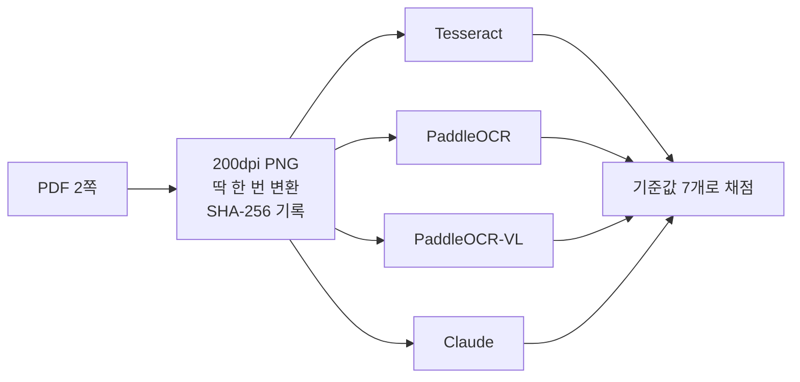
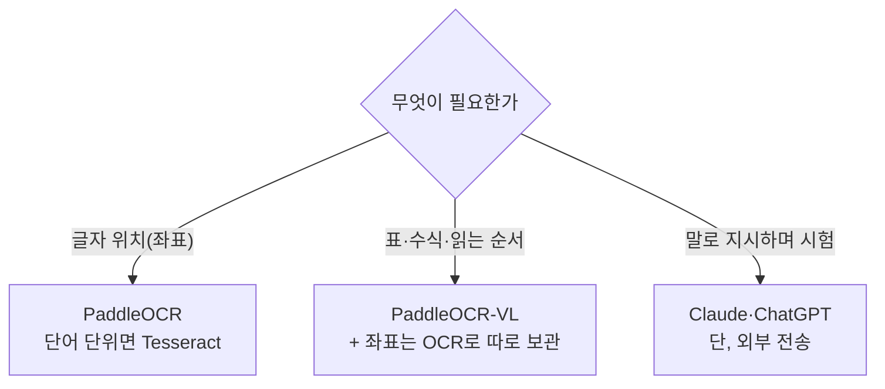

> **한 줄 요약**
> 글자만 필요하면 PaddleOCR, 표·수식·읽는 순서가 필요하면 문서 VLM.
> 단 VLM은 **38배 느리고** 쪽번호 같은 귀퉁이 글자를 버립니다.

"어느 OCR이 최고인가"를 가리는 글이 아닙니다. **같은 픽셀을 넣으면 도구마다 무엇이 달라지는지** 본 기록입니다.

## 실험 설계

비교가 성립하려면 네 도구가 **같은 것**을 봐야 합니다. PDF를 200dpi PNG로 딱 한 번 변환하고 SHA-256을 남긴 뒤, 그 파일을 네 곳에 그대로 넣었습니다.



| 페이지 | 원문 | 왜 골랐나 |
| --- | --- | --- |
| page1 | 현대차 매뉴얼 p.489 | **병합 셀**과 **흰 글자** |
| page2 | 평가원 수학 p.3 | **2단 편집**과 **수식** |

## 채점 결과

| # | 기준값 | Tesseract | PaddleOCR | PaddleOCR-VL | Claude |
| --- | --- | --- | --- | --- | --- |
| 1 | 수치 + 각주 첨자 | partial | **exact** | **exact** | **exact** |
| 2 | 병합 셀 `윤거` 전/후 | missing | partial | **exact** | **exact** |
| 3 | 표 2행 + 병합값 | partial | partial | **exact** | **exact** |
| 4 | 흰 글자 헤더 | partial | **exact** | **exact** | **exact** |
| 5 | 2단 읽기 순서 | partial | partial | **exact** | **exact** |
| 6 | 수식 3개 | missing | partial | **exact** | **exact** |
| E1 | 쪽번호·저작권 문구 | **exact** | **exact** | **missing** | **exact** |

마지막 줄이 반전입니다. 1~6을 다 맞힌 VL이 **유일하게 놓친 칸**이고, 가장 약한 Tesseract조차 잡은 걸 못 잡았습니다.

---

## 장면 1 — 흰 글자는 아예 안 보인다


가운데가 Tesseract입니다. 남색 배경 흰 글자 위에 **박스가 하나도 없습니다.**
잘못 읽은 게 아니라 **글자가 있다는 것조차 몰랐습니다.**

page2에서도 큼직한 제목 `수학 영역`과 쪽번호 `3`을 통째로 놓쳤습니다.

## 장면 2 — 2단을 가로로 읽는다

Tesseract가 뱉은 한 줄입니다.

```text
8. 삼 각 형 480 에 서   10. 두 양 수 @, ? 가
└── 왼쪽 단 8번 ──┘     └── 오른쪽 단 10번 ──┘
```

두 단이 한 줄로 붙었습니다. PaddleOCR도 `8 → 10 → 9` 순서로 냈습니다.

> **좌표가 있다는 것과 단 구조를 안다는 건 다른 얘기입니다.**

## 장면 3 — 문서 VLM은 표를 구조째 살린다

```html
<td rowspan="2">윤거</td><td>전</td><td>1,638</td>
                         <td>후</td><td>1,647</td>
```

`윤거`가 두 행에 걸친다는 사실이 `rowspan="2"`로 남았습니다.
PaddleOCR은 같은 글자를 **전부 정확히 읽고도** 어느 값이 어느 칸과 짝인지는 복원하지 못했습니다.

수식도 그대로 나옵니다.

```latex
\cos A = -\frac{1}{4}        \log_{9}a + \log_{3}b = 2
```

PaddleOCR은 같은 자리를 `logga +l0g3b`로 뭉갰습니다.

## 장면 4 — 그런데 쪽번호를 버렸다

VL은 page2 하단 저작권 문구와 쪽번호를 출력에 넣지 않았습니다. 레이아웃 모델이 꼬리말로 분류한 듯합니다.
오독도 남습니다. `대기압력` → **`대기업력`**, `리페어 킷` → **`리페어 킨`**.

> **VLM은 답을 주지만, 그 답이 어디서 왔는지는 안 알려 줍니다.**
> `대기업력`이 틀린 걸 알아도 원본 어디를 봐야 할지 모릅니다.
> 그래서 표를 잘 복원해도 **전용 OCR 좌표를 같이 남겨야** 합니다.

---

## 값을 시간으로 샀다

| 도구 | 2쪽 처리 | 데이터 위치 |
| --- | --- | --- |
| Tesseract | 39초 | 로컬 |
| PaddleOCR | 137초 | 로컬 |
| PaddleOCR-VL | **25분** (+준비 4.5분) | 로컬 |
| Claude | — | **외부 전송** |

VL은 Tesseract의 **38배**입니다. CPU 기준이고, 강의는 원래 GPU 전제입니다.

## Claude 열은 조건이 달랐습니다

정직하게 적자면 같은 잣대로 읽으면 안 됩니다.

- 넷 중 **혼자만 말로 된 지시**를 받았습니다 — "모르는 곳은 `[UNCLEAR]`로". 나머지 셋은 그런 입구가 없습니다
- 그림이 **멋대로 줄어서** 갔습니다 — page2가 0.605배
- 그림이 **외부 서버로** 나갔습니다

> 편한 만큼 근거가 없습니다. 그리고 **읽기 편하면 사람이 덜 의심합니다.**

---

## Windows에서 막힌 네 군데

<details>
<summary><strong>에러 메시지로 검색해도 잘 안 나오는 것들 (펼치기)</strong></summary>

**① paddlepaddle CPU가 oneDNN에서 죽는다**

```
NotImplementedError: (Unimplemented) ConvertPirAttribute2RuntimeAttribute
not support [pir::ArrayAttribute<pir::DoubleAttribute>]
```

→ `enable_mkldnn=False`. 느려지지만 같은 가중치로 정상 추론됩니다.

**② 큰 이미지에서 트레이스백 없이 프로세스가 죽는다**

2339×3309를 `PP-OCRv5_server_det`가 원본 해상도로 처리하다 네이티브 크래시. 파이썬 예외가 아니라 로그에 아무것도 안 남습니다.

```python
text_det_limit_type="max", text_det_limit_side_len=1600
```

→ 박스는 원본 좌표로 돌아오고 인식은 원본에서 잘라 쓰므로 품질은 유지됩니다.

**③ `PaddleOCR-VL-1.6`은 로컬에서 못 쓴다**

```
ValueError: No engine bindings registered for model 'PaddleOCR-VL-1.6'.
```

→ 그건 vLLM·sglang **서버 설정용 이름**입니다. 로컬 추론에 등록된 id는 **`PaddleOCR-VL-1.6-0.9B`**. `-0.9B`가 붙어야 합니다.

**④ Tesseract 언어 데이터를 Program Files에 못 넣는다**

관리자 권한이 필요합니다. → 프로젝트 안에 `tessdata/`를 만들고 `eng`·`osd`를 복사한 뒤 `kor.traineddata`를 받아 `TESSDATA_PREFIX`로 가리켰습니다.

</details>

---

## 덤 — 같은 사진, 세 가지 YOLO


| head | 주는 것 | 못 하는 것 |
| --- | --- | --- |
| detect | 박스 + 클래스 | 윤곽·자세 모름 |
| segment | 개체별 마스크 | 자세 모름 |
| pose | 사람 관절점 | **버스는 아예 안 잡음** |

임계값을 바꿔 봤습니다.

| 작업 | 0.15 | 0.25 | 0.60 |
| --- | --- | --- | --- |
| detect | **6** | 5 | 5 |
| segment | 5 | 5 | 5 |
| pose | 5 | 5 | **3** |

detect는 0.25 → 0.60에서 **아무 일도 안 일어났습니다.** 남은 다섯이 전부 0.66 이상이라 걸릴 게 없었습니다.
pose는 **0.15까지 내려도 버스를 안 잡습니다.** 임계값 문제가 아니라 keypoint 정의가 사람 몸을 대상으로 하기 때문입니다.

---

## 언제 뭘 쓸까



**사람이 원문을 꼭 다시 봐야 할 때**

- 진한 배경의 흰 글자
- 칸이 합쳐진 표
- 2단 편집
- 작은 첨자
- **도구마다 답이 다를 때** ← 제일 중요

마지막이 핵심입니다. `대기압력`과 `대기업력`은 **한쪽만 보면 틀린 줄도 모릅니다.**

## 한계

입력 2쪽, 한 번 돌린 결과입니다. 문서가 바뀌면 순위도 바뀝니다.
그래서 이 표의 제목은 "정확도 순위"가 아니라 **"이 입력에서 관찰한 차이"** 입니다.
